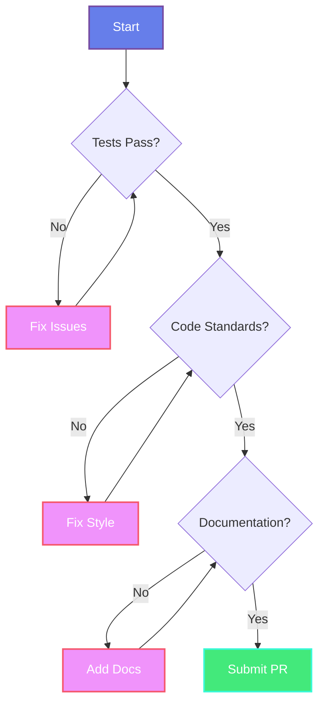

# 🤝 Contributing to Med Calculators

<div align="center">


**Thank you for considering contributing to Med Calculators! 🎉**

**شكراً لك على التفكير في المساهمة في Med Calculators! 🎉**

</div>

---

## 📋 Table of Contents

- [Code of Conduct](#-code-of-conduct)
- [How Can I Contribute?](#-how-can-i-contribute)
- [Development Setup](#-development-setup)
- [Coding Standards](#-coding-standards)
- [Commit Guidelines](#-commit-guidelines)
- [Pull Request Process](#-pull-request-process)

---

## 📜 Code of Conduct

<div dir="rtl">

### قواعد السلوك

- **كن محترماً:** عامل الجميع باحترام ولطف
- **كن مفيداً:** ساعد الآخرين وشارك معرفتك
- **كن بنّاءاً:** قدم نقداً بنّاءاً ومفيداً
- **كن صبوراً:** تذكر أن الجميع هنا للتعلم

</div>

### English

- **Be respectful:** Treat everyone with respect and kindness
- **Be helpful:** Help others and share your knowledge
- **Be constructive:** Provide constructive and helpful feedback
- **Be patient:** Remember everyone is here to learn

---

## 🎯 How Can I Contribute?

### 🐛 Reporting Bugs

Found a bug? Help us fix it!

<table>
<tr>
<td width="50%" dir="rtl">

**قبل الإبلاغ عن خطأ:**

1. ✅ تأكد من أنك تستخدم أحدث إصدار
2. ✅ ابحث في Issues الحالية
3. ✅ جرب تعطيل الإضافات الأخرى
4. ✅ جرب ثيم WordPress الافتراضي

**معلومات مطلوبة:**

- نسخة WordPress
- نسخة PHP
- نسخة الإضافة
- خطوات إعادة المشكلة
- رسائل الخطأ (إن وجدت)
- صور توضيحية

</td>
<td width="50%">

**Before Reporting:**

1. ✅ Ensure you're using the latest version
2. ✅ Search existing Issues
3. ✅ Try disabling other plugins
4. ✅ Try default WordPress theme

**Required Information:**

- WordPress version
- PHP version
- Plugin version
- Steps to reproduce
- Error messages (if any)
- Screenshots

</td>
</tr>
</table>

### ✨ Suggesting Features

Have an idea? We'd love to hear it!

```markdown
**Feature Title:** Clear and descriptive title

**Description:** What problem does this solve?

**Proposed Solution:** How should it work?

**Alternatives:** Other solutions you've considered

**Additional Context:** Screenshots, mockups, etc.
```

### 💻 Code Contributions

Want to contribute code? Awesome!


---

## 🛠️ Development Setup

### Prerequisites

```bash
# Required
- PHP 7.4 or higher
- WordPress 5.0 or higher
- MySQL 5.6 or higher
- Git
- Composer (optional)
```

### Local Setup

<table>
<tr>
<td width="50%" dir="rtl">

### إعداد البيئة المحلية

```bash
# 1. Fork الريبو على GitHub

# 2. Clone مشروعك
git clone https://github.com/YOUR-USERNAME/med-calculators-v2.git

# 3. إنشاء فرع جديد
cd med-calculators-v2
git checkout -b feature/amazing-feature

# 4. نسخ إلى مجلد الإضافات
cp -r med-calculators-v2 /path/to/wordpress/wp-content/plugins/

# 5. تفعيل الإضافة من لوحة WordPress
```

</td>
<td width="50%">

### Local Environment Setup

```bash
# 1. Fork the repo on GitHub

# 2. Clone your fork
git clone https://github.com/YOUR-USERNAME/med-calculators-v2.git

# 3. Create a new branch
cd med-calculators-v2
git checkout -b feature/amazing-feature

# 4. Copy to plugins folder
cp -r med-calculators-v2 /path/to/wordpress/wp-content/plugins/

# 5. Activate plugin in WordPress
```

</td>
</tr>
</table>

---

## 📝 Coding Standards

### PHP Standards

```php
// ✅ Good
function med_calc_get_data( $id ) {
    if ( empty( $id ) ) {
        return false;
    }
    
    $data = get_option( 'med_calc_' . $id );
    return $data;
}

// ❌ Bad
function getData($id){
  if(empty($id)) return false;
  $data=get_option('med_calc_'.$id);
  return $data;
}
```

### WordPress Coding Standards

- Follow [WordPress Coding Standards](https://developer.wordpress.org/coding-standards/wordpress-coding-standards/)
- Use WordPress functions when available
- Escape output: `esc_html()`, `esc_attr()`, `wp_kses_post()`
- Sanitize input: `sanitize_text_field()`, `sanitize_email()`
- Validate and check nonces for security

### JavaScript Standards

```javascript
// ✅ Good - Modern ES6+
const calculateBMR = (weight, height, age, gender) => {
    if (!weight || !height || !age) {
        return 0;
    }
    
    return gender === 'male' 
        ? (10 * weight) + (6.25 * height) - (5 * age) + 5
        : (10 * weight) + (6.25 * height) - (5 * age) - 161;
};

// ❌ Bad
function calculateBMR(w,h,a,g){
  if(!w||!h||!a)return 0;
  return g=='male'?(10*w)+(6.25*h)-(5*a)+5:(10*w)+(6.25*h)-(5*a)-161;
}
```

### CSS Standards

```css
/* ✅ Good - BEM Methodology */
.med-calc__wrapper {
    display: flex;
    gap: 1rem;
}

.med-calc__button {
    padding: 0.75rem 1.5rem;
    border-radius: 0.5rem;
}

.med-calc__button--primary {
    background: var(--primary-color);
}

/* ❌ Bad */
.wrapper{display:flex;gap:1rem}
.btn{padding:.75rem 1.5rem;border-radius:.5rem}
.primary{background:var(--primary-color)}
```

---

## 📌 Commit Guidelines

### Commit Message Format

```
<type>(<scope>): <subject>

<body>

<footer>
```

### Types

| Type | Description | Example |
|------|-------------|---------|
| `feat` | New feature | `feat(calculator): add BMI calculator` |
| `fix` | Bug fix | `fix(pregnancy): correct due date calculation` |
| `docs` | Documentation | `docs(readme): update installation steps` |
| `style` | Code style | `style(css): improve button hover effects` |
| `refactor` | Code refactoring | `refactor(ajax): simplify request handler` |
| `test` | Tests | `test(calories): add unit tests for macros` |
| `chore` | Maintenance | `chore(deps): update dependencies` |

### Examples

```bash
# ✅ Good
git commit -m "feat(ovulation): add fertile window visualization"

git commit -m "fix(translation): correct Arabic plural forms

- Fixed ngettext filter for proper pluralization
- Updated ar.php translation file
- Tested with different day counts"

# ❌ Bad
git commit -m "fixed stuff"
git commit -m "WIP"
git commit -m "update"
```

---

## 🔄 Pull Request Process

### Before Submitting

<div align="center">



</div>

### Checklist

- [ ] 📝 Code follows WordPress and plugin coding standards
- [ ] ✅ All tests pass
- [ ] 📚 Documentation is updated
- [ ] 🌍 Translations are updated (if applicable)
- [ ] 🔍 Self-reviewed the code
- [ ] 💬 Added meaningful commit messages
- [ ] 📸 Added screenshots (if UI changes)
- [ ] ⚡ Tested on different browsers
- [ ] 📱 Tested responsive design

### PR Template

```markdown
## Description
Brief description of changes

## Type of Change
- [ ] Bug fix
- [ ] New feature
- [ ] Breaking change
- [ ] Documentation update

## Testing
How has this been tested?

## Screenshots
(if applicable)

## Related Issues
Closes #123
```

---

## 🧪 Testing

### Manual Testing

```bash
# 1. Test all calculators
- Pregnancy calculator
- Ovulation calculator
- Calorie calculator

# 2. Test translations
- Switch to Arabic
- Check RTL layout
- Verify all strings

# 3. Test admin dashboard
- View statistics
- Export CSV
- Update settings

# 4. Test compatibility
- Different WordPress versions
- Different PHP versions
- Different themes
- With/without Elementor
```

### Browser Testing

- ✅ Chrome (latest)
- ✅ Firefox (latest)
- ✅ Safari (latest)
- ✅ Edge (latest)
- ✅ Mobile browsers

---

## 📚 Resources

### Helpful Links

- [WordPress Codex](https://codex.wordpress.org/)
- [WordPress Coding Standards](https://developer.wordpress.org/coding-standards/)
- [PHP Documentation](https://www.php.net/docs.php)
- [Elementor Developers](https://developers.elementor.com/)

### Contact

- 💬 **GitHub Issues:** [Create an Issue](../../issues)
- 📧 **Email:** mahmoud.nour@developer.com
- 🌐 **Portfolio:** [mahmoudnour.dev](https://mahmoudnour.dev)

---

<div align="center">

## 🙏 Thank You!

### Your contributions make this project better for everyone!

**مساهماتك تجعل هذا المشروع أفضل للجميع!**

<br/>


**~ Mahmoud Nour | Software Developer**

</div>
