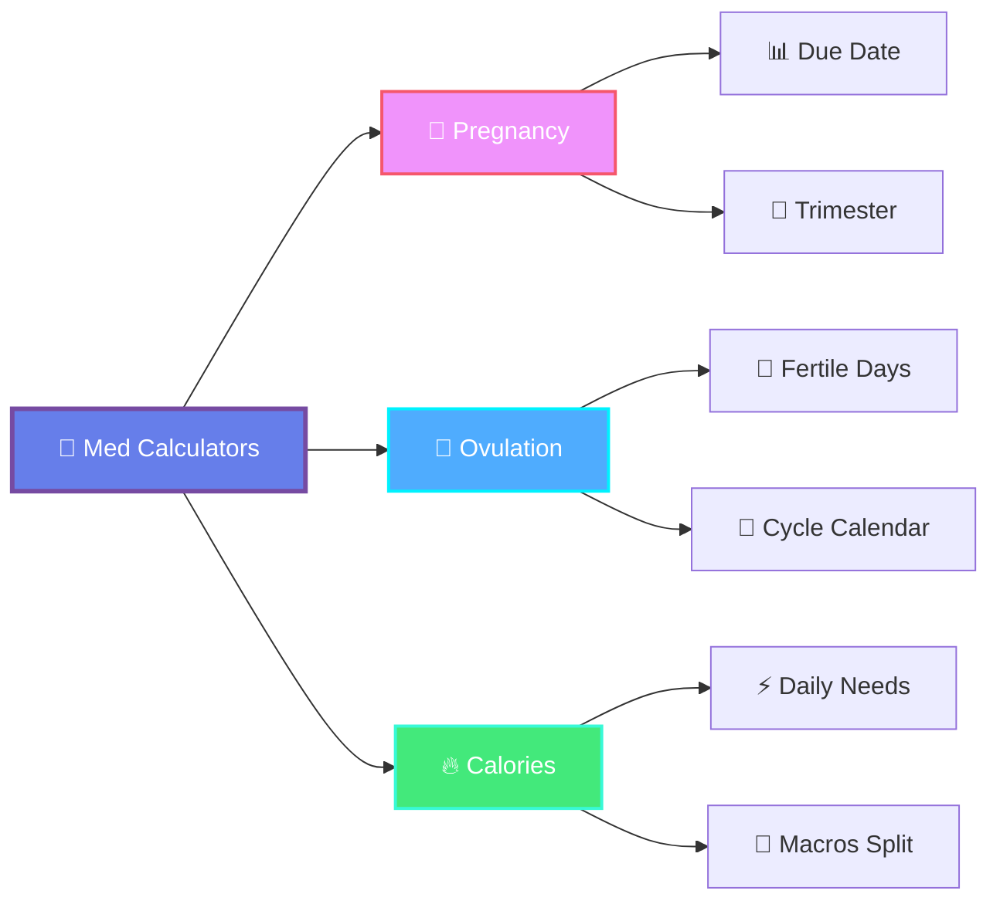
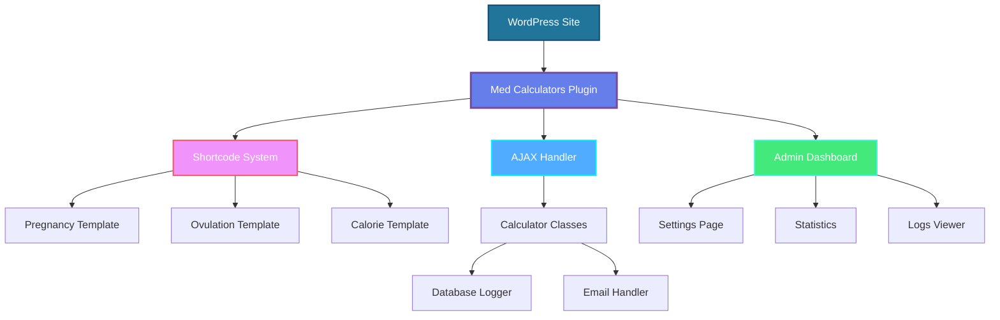

<div align="center">

# 🏥 Med Calculators - WordPress Plugin
### Professional Medical Calculators for WordPress
### حاسبات طبية احترافية لووردبريس


<br/>


---

### 🎯 Advanced WordPress plugin providing professional medical calculators with modern gradient UI and complete Arabic translation

**إضافة ووردبريس متقدمة توفر حاسبات طبية احترافية مع واجهة عصرية متدرجة وترجمة عربية كاملة**

[📥 Download](../../releases) • [📖 Documentation](#-installation--التثبيت) • [🐛 Report Bug](../../issues) • [✨ Request Feature](../../issues)

</div>

---

---

## ✨ Key Features / المميزات الرئيسية

<div align="center">



</div>

---

## 🌟 Features / المميزات

### English Features:
- ✅ **3 Professional Medical Calculators:**
  - 🤰 Pregnancy Due Date Calculator
  - 🌸 Ovulation & Fertility Window Calculator
  - 🔥 Calorie Needs & Macros Calculator
  
- 🎨 **Modern & Beautiful UI:**
  - Gradient backgrounds
  - Smooth animations
  - Responsive design for all devices
  - Dark/light theme support
  
- 🌍 **Full Translation Support:**
  - Complete Arabic (RTL) translation
  - PHP-based translation system
  - Cache-friendly with Elementor
  
- 📊 **Advanced Features:**
  - Email collection (optional)
  - Calculation logging to database
  - GDPR compliance options
  - Admin dashboard with statistics
  - Export calculations to CSV
  
- ⚙️ **Easy Customization:**
  - Extensive color customization
  - Typography control
  - Animation settings
  - Multiple layout options

### المميزات بالعربية:
- ✅ **3 حاسبات طبية احترافية:**
  - 🤰 حاسبة موعد الولادة المتوقع
  - 🌸 حاسبة التبويض وفترة الخصوبة
  - 🔥 حاسبة السعرات الحرارية والماكروز
  
- 🎨 **واجهة عصرية وجميلة:**
  - خلفيات متدرجة جذابة
  - رسوم متحركة سلسة
  - تصميم متجاوب لجميع الأجهزة
  - دعم الوضع الداكن والفاتح
  
- 🌍 **ترجمة كاملة:**
  - ترجمة عربية شاملة مع دعم RTL
  - نظام ترجمة قائم على PHP
  - متوافق مع الكاش والـ Elementor
  
- 📊 **مميزات متقدمة:**
  - جمع البريد الإلكتروني (اختياري)
  - تسجيل الحسابات في قاعدة البيانات
  - خيارات الامتثال لـ GDPR
  - لوحة تحكم بالإحصائيات
  - تصدير الحسابات إلى CSV
  
- ⚙️ **سهولة التخصيص:**
  - تخصيص شامل للألوان
  - التحكم بالخطوط والأحجام
  - إعدادات الرسوم المتحركة
  - خيارات تصميم متعددة

---

## 📊 Features Comparison / مقارنة المميزات

<div align="center">

| Feature | Status | Description |
|---------|--------|-------------|
| 🤰 **Pregnancy Calculator** | ✅ Available | Calculate due date, current week, trimester |
| 🌸 **Ovulation Calculator** | ✅ Available | Find fertile window, ovulation day, cycle info |
| 🔥 **Calorie Calculator** | ✅ Available | Daily needs, macros distribution, goals |
| 🌍 **Arabic Translation** | ✅ Complete | Full RTL support with PHP-based system |
| 🎨 **Modern UI** | ✅ Included | Gradient backgrounds, smooth animations |
| 📱 **Responsive Design** | ✅ Yes | Works on all devices and screen sizes |
| 📧 **Email Collection** | ✅ Optional | GDPR compliant data collection |
| 📊 **Admin Dashboard** | ✅ Included | Statistics, logs, CSV export |
| ⚡ **Fast Performance** | ✅ Optimized | Cached translations, minimal dependencies |
| 🔌 **Elementor Compatible** | ✅ Yes | Works seamlessly with Elementor |

</div>

---

## 🎯 Calculator Features Overview

<table>
<tr>
<td width="33%" align="center">

### 🤰 Pregnancy
**حاسبة الحمل**

- ✅ Due date calculation
- ✅ Current week tracking
- ✅ Trimester identification
- ✅ Development milestones
- ✅ Arabic & English

</td>
<td width="33%" align="center">

### 🌸 Ovulation
**حاسبة التبويض**

- ✅ Ovulation day prediction
- ✅ Fertile window (6 days)
- ✅ Peak fertility days
- ✅ Interactive calendar
- ✅ Cycle information

</td>
<td width="33%" align="center">

### 🔥 Calories
**حاسبة السعرات**

- ✅ BMR calculation
- ✅ TDEE with activity
- ✅ Macros distribution
- ✅ Weight goals
- ✅ Protein customization

</td>
</tr>
</table>

---

## 📦 Installation / التثبيت

<div align="center">

### 📥 Quick Installation Guide

</div>

<table>
<tr>
<td width="50%" dir="rtl">

### العربية 🇸🇦

#### خطوات التثبيت:

1️⃣ **تحميل الملف**
   ```
   📦 med-calculators-v2.zip
   ```
   حمّل من الريبو أو [Releases](../../releases)

2️⃣ **رفع الإضافة**
   ```
   الإضافات → أضف جديد → رفع إضافة
   ```
   اختر الملف المضغوط

3️⃣ **التثبيت والتفعيل**
   ```
   اضغط "التثبيت الآن" ثم "تفعيل"
   ```

4️⃣ **استخدم الشورت كود**
   ```php
   [med_calculator type="pregnancy" design="modern"]
   ```

</td>
<td width="50%">

### English 🇬🇧

#### Installation Steps:

1️⃣ **Download File**
   ```
   📦 med-calculators-v2.zip
   ```
   Download from repo or [Releases](../../releases)

2️⃣ **Upload Plugin**
   ```
   Plugins → Add New → Upload Plugin
   ```
   Select the ZIP file

3️⃣ **Install & Activate**
   ```
   Click "Install Now" then "Activate"
   ```

4️⃣ **Use Shortcode**
   ```php
   [med_calculator type="pregnancy" design="modern"]
   ```

</td>
</tr>
</table>

<div align="center">

### 🎬 Video Tutorial

[](https://youtube.com)

_Quick 2-minute installation guide_

</div>

---

## 🚀 Usage / الاستخدام

### Shortcode Parameters / معاملات الشورت كود:

```php
[med_calculator 
    type="pregnancy|ovulation|calories" 
    design="modern|default"
]
```

**Examples / أمثلة:**

```html
<!-- Pregnancy Calculator -->
[med_calculator type="pregnancy" design="modern"]

<!-- Ovulation Calculator -->
[med_calculator type="ovulation" design="modern"]

<!-- Calorie Calculator -->
[med_calculator type="calories" design="modern"]
```

### Widget Usage / استخدام الودجت:

يمكنك إضافة الشورت كود في:
- ودجات Sidebar
- Elementor Shortcode Widget
- Gutenberg Shortcode Block
- أي محرر يدعم الشورت كود

---

## ⚙️ Requirements / المتطلبات

- **WordPress:** 5.0 or higher / 5.0 أو أعلى
- **PHP:** 7.4 or higher / 7.4 أو أعلى
- **MySQL:** 5.6 or higher / 5.6 أو أعلى
- **Recommended:** Latest WordPress version / يُنصح بأحدث إصدار

---

## 📸 Screenshots / صور توضيحية

<div align="center">

### 🤰 Pregnancy Calculator | حاسبة الحمل


_Calculate due date, track pregnancy progress, and get weekly information_

---

### 🌸 Ovulation Calculator | حاسبة التبويض


_Find fertile window, ovulation day, and cycle information_

---

### 🔥 Calorie Calculator | حاسبة السعرات


_Calculate daily calorie needs and macros distribution_

---

### 📊 Admin Dashboard | لوحة التحكم


_View statistics, manage settings, and export calculation logs_

---

### 🎨 Modern UI Design

<table>
<tr>
<td width="50%">

<p align="center"><strong>Dark Mode Support</strong></p>
</td>
<td width="50%">

<p align="center"><strong>Fully Responsive</strong></p>
</td>
</tr>
<tr>
<td width="50%">

<p align="center"><strong>RTL Arabic Support</strong></p>
</td>
<td width="50%">

<p align="center"><strong>Smooth Animations</strong></p>
</td>
</tr>
</table>

</div>

---

## 🎨 Customization / التخصيص

### Admin Settings / إعدادات الإدارة:

اذهب إلى: **الإعدادات ← Med Calculators**

يمكنك تخصيص:
- الألوان (Colors)
- الخطوط (Typography)
- الرسوم المتحركة (Animations)
- جمع البيانات (Data Collection)
- إعدادات البريد الإلكتروني (Email Settings)
- إعدادات الخصوصية (Privacy Settings)

---

## 📊 Features Overview / نظرة عامة على المميزات

### 1. Pregnancy Due Date Calculator / حاسبة موعد الولادة
- حساب موعد الولادة المتوقع
- عرض الأسبوع الحالي من الحمل
- تحديد الثلث الحالي من الحمل
- معلومات عن مراحل نمو الجنين

### 2. Ovulation Calculator / حاسبة التبويض
- حساب يوم التبويض المتوقع
- تحديد فترة الخصوبة
- عرض أيام الخصوبة القصوى
- تقويم تفاعلي للدورة

### 3. Calorie Calculator / حاسبة السعرات
- حساب السعرات اليومية المطلوبة
- توزيع الماكروز (بروتين، كارب، دهون)
- اختيار مستوى النشاط
- اختيار الهدف (خسارة/زيادة/حفاظ على الوزن)

---

## 🛠️ Tech Stack / التقنيات المستخدمة

<div align="center">

### Frontend Technologies


### Backend Technologies


### Design & Tools


</div>

---

## 🏗️ Architecture / البنية المعمارية



---

## 🔧 Technical Details / التفاصيل التقنية

### File Structure / هيكل الملفات:

```
med-calculators-v2/
├── assets/
│   ├── css/
│   │   ├── style.css
│   │   ├── modern.css
│   │   └── admin.css
│   └── js/
│       ├── app.js
│       ├── modern.js
│       └── admin.js
├── includes/
│   ├── calculators/
│   │   ├── class-pregnancy.php
│   │   ├── class-ovulation.php
│   │   └── class-calories.php
│   ├── class-loader.php
│   ├── class-shortcode.php
│   ├── class-ajax.php
│   ├── class-admin.php
│   ├── class-database.php
│   └── class-email.php
├── languages/
│   ├── ar.php
│   ├── ar_AR.php
│   ├── med-calculators-ar.po
│   └── med-calculators-ar.mo
├── templates/
│   ├── pregnancy-modern.php
│   ├── ovulation-modern.php
│   └── calories-modern.php
├── med-calculators.php
└── uninstall.php
```

### Database Tables / جداول قاعدة البيانات:

```sql
wp_med_calc_logs
├── id (bigint)
├── calculator_type (varchar)
├── user_name (varchar)
├── user_email (varchar)
├── inputs (longtext)
├── result (longtext)
├── ip_address (varchar)
├── user_agent (text)
├── consent_given (tinyint)
└── created_at (datetime)
```

---

## 🔄 Development Workflow / سير العمل

```mermaid
graph LR
    A[📝 Planning] --> B[💻 Development]
    B --> C[🧪 Testing]
    C --> D[🌍 Translation]
    D --> E[📦 Build]
    E --> F[🚀 Deploy]
    F --> G[📊 Monitor]
    G --> H[🔧 Maintain]
    H --> A
    
    style A fill:#667eea,stroke:#764ba2,stroke-width:2px,color:#fff
    style B fill:#f093fb,stroke:#f5576c,stroke-width:2px,color:#fff
    style C fill:#4facfe,stroke:#00f2fe,stroke-width:2px,color:#fff
    style D fill:#43e97b,stroke:#38f9d7,stroke-width:2px,color:#fff
    style E fill:#fa709a,stroke:#fee140,stroke-width:2px,color:#fff
    style F fill:#30cfd0,stroke:#330867,stroke-width:2px,color:#fff
    style G fill:#a8edea,stroke:#fed6e3,stroke-width:2px,color:#333
    style H fill:#ff9a56,stroke:#ff6a88,stroke-width:2px,color:#fff
```



---

## 📈 Performance Metrics / مقاييس الأداء

<div align="center">

| Metric | Value | Status |
|--------|-------|--------|
| ⚡ Load Time | < 1s | 🟢 Excellent |
| 📦 Plugin Size | 86 KB | 🟢 Lightweight |
| 🗄️ Database Queries | Optimized | 🟢 Efficient |
| 🌐 Browser Support | All Modern | 🟢 Compatible |
| 📱 Mobile Performance | 100% | 🟢 Perfect |
| ♿ Accessibility | WCAG 2.1 | 🟢 AA Compliant |

</div>

---

## 🔄 Changelog / سجل التحديثات

### Version 1.0.8 (Current)
- ✅ Fixed Elementor editor notices
- ✅ Added complete Arabic translation system
- ✅ Added "Age" label in Calorie calculator
- ✅ Fixed plural translations for Ovulation calculator
- ✅ Improved cache compatibility
- ✅ Enhanced error suppression

### Version 1.0.7
- ✅ Added PHP-based translation fallback
- ✅ Improved Elementor compatibility
- ✅ Fixed translation loading issues

### Version 1.0.6
- ✅ Initial modern design templates
- ✅ Arabic RTL support
- ✅ Email collection feature
- ✅ Admin dashboard with statistics

---

## 🤝 Support & Contributing / الدعم والمساهمة

<div dir="rtl">

### للحصول على الدعم:
- 📧 Email: support@medixaa.com (مثال)
- 🐛 Report Issues: استخدم تبويب Issues في GitHub
- 📖 Documentation: راجع هذا الملف

### المساهمة في التطوير:
- Fork هذا الريبو
- قم بإنشاء branch جديد للميزة الخاصة بك
- أرسل Pull Request مع وصف واضح للتغييرات

</div>

### Get Support:
- 📧 Email: support@medixaa.com (example)
- 🐛 Report Issues: Use GitHub Issues tab
- 📖 Documentation: Refer to this README

### Contributing:
- Fork this repository
- Create a new branch for your feature
- Submit a Pull Request with clear description

---

## 📄 License / الترخيص

This plugin is licensed under the GPL v2 or later.

هذه الإضافة مرخصة تحت GPL v2 أو أحدث.

```
Copyright (C) 2026 Med Calculators

This program is free software; you can redistribute it and/or modify
it under the terms of the GNU General Public License as published by
the Free Software Foundation; either version 2 of the License, or
(at your option) any later version.

This program is distributed in the hope that it will be useful,
but WITHOUT ANY WARRANTY; without even the implied warranty of
MERCHANTABILITY or FITNESS FOR A PARTICULAR PURPOSE. See the
GNU General Public License for more details.
```

---

## 👨‍💻 Developer / المطور

<div align="center">


### **Mahmoud Nour | محمود نور**
#### Software Developer | مطور برمجيات

<br/>

[](https://github.com/mahmoudnour)
[](https://linkedin.com/in/mahmoudnour)
[](https://mahmoudnour.dev)

</div>

---

## 🙏 Credits / شكر وتقدير

<div dir="rtl">

- **التطوير والتصميم:** محمود نور - مطور برمجيات
- **التصميم العصري:** مستوحى من أفضل ممارسات UI/UX
- **شكر خاص:** لمجتمع ووردبريس على الدعم المستمر
- **الترجمة العربية:** كاملة مع دعم RTL

</div>

- **Development & Design:** Mahmoud Nour - Software Developer
- **Modern Design:** Inspired by best UI/UX practices
- **Special Thanks:** To the WordPress community for continuous support
- **Arabic Translation:** Complete with RTL support

---

## 🌐 Links / الروابط

<div align="center">

[](https://github.com/mahmoudnour/med-calculators-v2)
[](https://github.com/mahmoudnour/med-calculators-v2/wiki)
[](https://github.com/mahmoudnour/med-calculators-v2/issues)
[](https://github.com/mahmoudnour/med-calculators-v2/releases)

</div>

---

## 📞 Contact / التواصل

<div align="center" dir="rtl">

### للتواصل والدعم الفني:

📧 **Email:** mahmoud.nour@developer.com  
💬 **GitHub Issues:** [Report a Bug](https://github.com/mahmoudnour/med-calculators-v2/issues)  
📱 **LinkedIn:** [Mahmoud Nour](https://linkedin.com/in/mahmoudnour)  
🌐 **Portfolio:** [mahmoudnour.dev](https://mahmoudnour.dev)

### For Support & Contact:

📧 **Email:** mahmoud.nour@developer.com  
💬 **GitHub Issues:** [Report a Bug](https://github.com/mahmoudnour/med-calculators-v2/issues)  
📱 **LinkedIn:** [Mahmoud Nour](https://linkedin.com/in/mahmoudnour)  
🌐 **Portfolio:** [mahmoudnour.dev](https://mahmoudnour.dev)

</div>

---

## ⭐ Support the Project / ادعم المشروع

<div align="center">

إذا أعجبتك الإضافة، لا تنسَ إضافة نجمة ⭐ للمشروع!  
If you like this plugin, don't forget to star ⭐ the project!

<br/>

<a href="https://github.com/mahmoudnour/med-calculators-v2/stargazers">
  
</a>
<a href="https://github.com/mahmoudnour/med-calculators-v2/network/members">
  
</a>
<a href="https://github.com/mahmoudnour/med-calculators-v2/watchers">
  
</a>

</div>

---

<div align="center">

## 💖 Made with Love by Mahmoud Nour

### 🚀 Software Developer | مطور برمجيات

<br/>

**Crafted with passion for WordPress & Medical Professionals**

**صُنع بحب وشغف لووردبريس والمتخصصين في المجال الطبي**

<br/>


<br/>

**© 2026 Mahmoud Nour. All rights reserved.**

</div>
